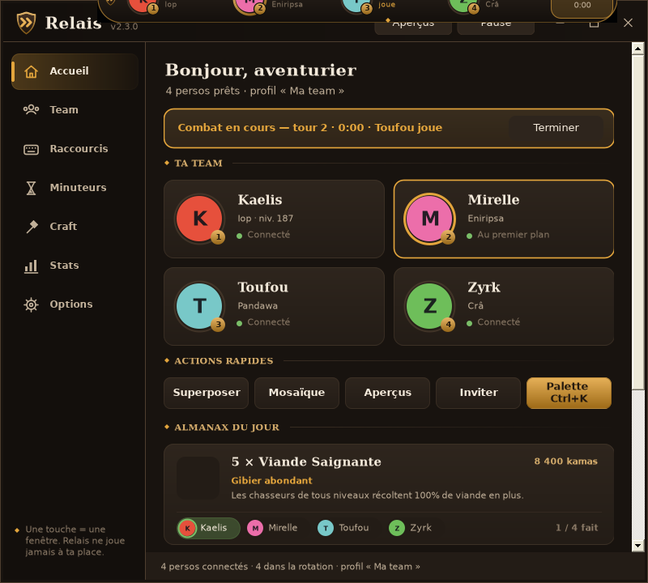

# Relais — organizer multicompte pour Dofus

**Une touche = une fenêtre.** Relais bascule sur le bon perso quand c'est son tour, range tes fenêtres,
suit tes combats et ton Almanax. Gratuit, open source, conforme à la règle d'Ankama
« une action physique = une action sur un seul compte » : Relais ne fait que changer de fenêtre.

## Télécharger

- [Relais-Setup.exe](https://github.com/Vior-g/relais/releases/latest/download/Relais-Setup.exe) — installateur
- [Relais.exe](https://github.com/Vior-g/relais/releases/latest/download/Relais.exe) — version portable

Windows 10/11, .NET Framework 4.8 (déjà présent). Les mises à jour se font ensuite toutes seules.

## Fonctions

- Raccourci par perso (clavier, boutons de souris, Alt + molette), ordre d'initiative par glisser-déposer
- Bascule automatique quand c'est le tour d'un perso, suivi des combats (tour, chrono, stats)
- Superposer / mosaïque sur l'écran de ton choix, aperçus en direct, vignette dans chaque fenêtre
- Palette de commandes **Ctrl+K**, mini-barre, sons discrets
- Télécommande sur téléphone (QR code), alertes Discord / ntfy
- Almanax du jour, minuteurs, rappels, carnet de craft DofusDB, fiches de perso
- Stats de jeu jusqu'à 1 an, sauvegarde des réglages sur GitHub, français / anglais

## Ce que Relais ne fait jamais

Envoyer un clic ou une touche au jeu, répéter une action sur plusieurs comptes, lire la mémoire ou le réseau du jeu.

## Compiler

Voir [COMPILER.md](COMPILER.md).

---
Projet de fan, non affilié à Ankama. Dofus est une marque d'Ankama.
